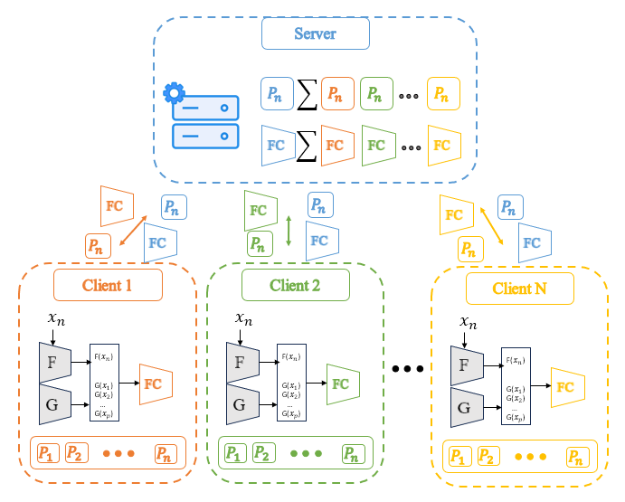

# Federated Class Incremental Learning: A Pseudo Feature Based Approach Without Exemplars

This repository contains the PyTorch implementation for the 2024 ACCV paper:  
**Federated Class Incremental Learning: A Pseudo Feature Based Approach Without Exemplars** <br>
This paper was selected for **oral presentation**, placing it in the top 5.6% of submissions.

Min Kyoon Yoo, Yu Rang Park  
Department of Biomedical Systems Informatics, Yonsei University College of Medicine, Seoul, Republic of Korea

## Paper  
The full paper can be accessed here:  
📄 **[Federated Class Incremental Learning: A Pseudo Feature Based Approach Without Exemplars](https://openaccess.thecvf.com/content/ACCV2024/html/Yoo_Federated_Class_Incremental_Learning_A_Pseudo_Feature_Based_Approach_Without_ACCV_2024_paper.html)**  


## Overview

In this work, we propose FCLPF (Federated Class Incremental Learning with Pseudo Features), a method designed to mitigate catastrophic forgetting in federated learning settings without relying on rehearsal memory or past data. Our approach leverages pseudo features generated from prototypes to enhance learning efficiency and reduce communication costs.

<p align="center">

</p>

## Abstract

Federated learning often assumes that data is fixed in advance, which is unrealistic in many real-world scenarios where new data continuously arrives, causing catastrophic forgetting. To address this challenge, we propose FCLPF, a method that uses pseudo features generated from prototypes to mitigate catastrophic forgetting. Our approach reduces communication costs and improves efficiency by eliminating the need for past data and avoiding computationally heavy models like GANs. Experimental results on CIFAR-100 and TinyImageNet demonstrate the effectiveness of our method.

## Installation

### Prerequisites
* python == 3.9.19
* torch == 1.13.1
* torchvision == 0.14.1

### Dataset
* Download the datasets (CIFAR-100, TinyImageNet) and set the directory in --path.

## Run Code

To run the code for the CIFAR-100 dataset with scenario 2:

```bash
python main.py --dataset=CIFAR100 --method=FCLPF --num_clients=50 --path=./data --n_tasks=11 --initial_classes=50 --increment_classes=5
```

## Experimental Results

### CIFAR-100
Our method was evaluated on the CIFAR-100 dataset. We conducted experiments across multiple scenarios to comprehensively assess the performance. The results showed a significant reduction in catastrophic forgetting and improved overall accuracy compared to existing methods.

### TinyImageNet
Similarly, on the TinyImageNet dataset, FCLPF outperformed baseline methods, showing less forgetting and higher retention of previously learned tasks.

<p align="center">

</p>
Figure 2: Comparison of model performance across different tasks and datasets. Our approach (blue line) consistently shows higher accuracy and less forgetting compared to MFCL, FedProx, and FedAvg across both CIFAR-100 and TinyImageNet datasets.

## Citation
If you have found our code or paper beneficial to your research, please consider citing it as:

```bibtex
@inproceedings{yoo2024federated,
  title={Federated Class Incremental Learning: A Pseudo Feature Based Approach Without Exemplars},
  author={Min Kyoon Yoo and Yu Rang Park},
  booktitle = {Proceedings of the Asian Conference on Computer Vision ({ACCV})},
  year={2024}
}
